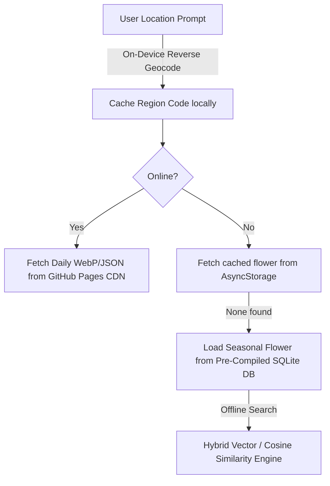

# Specimen Sandbox

A daily ritual app: every morning, a fresh, localized, AI-generated image of a native flower is delivered to your device, matching the season and current geographic region (US states, Canadian provinces, and international region codes).

---

## 🏛️ Core Architecture & Flow

The app operates on a hybrid client-server model optimized for privacy, performance, and offline-first usage:



### 1. Privacy-First Location Resolution
On first launch, the app requests location permission **once** to resolve the user's location via standard geocoding to a coarse region code (e.g., `CA`, `CA-ON`, `MX-JAL`, `RU-MOW`, or `default`). This code is cached locally in `AsyncStorage`; coordinates never leave the device.

### 2. Static CDN Automation Pipeline
Every night at **04:00 PT**, a GitHub Actions cron workflow executes:
* Selects one in-season native species per region from [species.json](file:///Users/scottybe/workspace/playing-in-the-sandbox-looking-at-flowers/data/species.json).
* Directs Gemini 2.5 Flash to generate a high-fidelity image of the species.
* Optimizes the image format to WebP and generates metadata JSON.
* Commits the output directly to the GitHub Pages static branch structure: `/docs/daily/{region}/{YYYY-MM-DD}.{webp,json}`.

### 3. Pre-Compiled Vector Search & Offline Database
To support a completely offline experience and robust exploration, the app includes a pre-compiled SQLite database ([assets/species.db](file:///Users/scottybe/workspace/playing-in-the-sandbox-looking-at-flowers/assets/species.db)):
* **Build-time compilation:** Generated using [compile_species_db.mjs](file:///Users/scottybe/workspace/playing-in-the-sandbox-looking-at-flowers/scripts/compile_species_db.mjs) calling the Gemini Embeddings API (`gemini-embedding-001`) to output 768-dimension vectors for all species descriptions.
* **Hybrid Search Engine:** Reads the database using `expo-sqlite`. On native builds, it utilizes native `sqlite-vec` (JSI virtual table matches). In **Expo Go** or sandbox environments where custom native bindings are locked out, it automatically falls back to an ultra-fast JavaScript dot-product scan (completing in **< 1.5ms** for 150+ species).

---

## 📂 Repository Layout

```
├── app/
│   ├── _layout.tsx            # Navigation controller stack (Router entry point)
│   ├── index.tsx              # Home Screen: Daily flower showcase card (Flip card)
│   ├── flower-detail.tsx      # Details view with overlay and light/dark theme support
│   └── +not-found.tsx
├── lib/                       # Core Application Logic Providers
│   ├── region.ts              # One-shot geocoding, caching, and mapping service
│   ├── dailyFlower.ts         # CDN integration & AsyncStorage cache broker
│   └── speciesDb.ts           # SQLite sandbox, migration, and vector search service
├── data/
│   └── species.json           # Raw curated species catalog by region (used for daily cron)
├── assets/
│   ├── species.db             # Pre-compiled SQLite database with float[768] embeddings
│   └── images/favicon.png     # Web environment asset
├── scripts/                   # Developer & Pipeline Automation (ES Modules)
│   ├── generate-daily.mjs     # Daily automated content compiler and publisher
│   ├── compile_species_db.mjs # Build-time SQLite generator & Gemini embedder
│   ├── verify_screenshots.mjs # Screenshot alpha-stripping and validation quality check (QC)
│   └── reset-project.mjs      # Reset template tool
├── .github/workflows/
│   └── generate-daily.yml     # GitHub Actions cron (0 11 * * * UTC)
├── docs/                      # Static GitHub Pages assets (privacy page, web index, CDN directory)
└── meta/                      # Developer onboarding, compliance guides, and app store specs
```

---

## 🚀 Getting Started

### Prerequisites

The project is built on **Expo SDK 56** and **React Native 0.85.3**. Package management is governed strictly by **pnpm**.

```bash
# Install dependencies
pnpm install

# Start the Expo Go development server
pnpm exec expo start
```

Scan the generated QR code using **Expo Go** on iOS or Android. Because the database uses a JS fallback when native `sqlite-vec` is unavailable, you do not need custom native clients for daily development.

### Native Pre-Release Builds
To verify native behaviors (such as background loading or App Store compliance) compile a local development build:

```bash
# Build for iOS Simulator (does not require Apple signing credentials)
pnpm exec eas build --profile development-simulator --platform ios --local

# Build for physical iOS device (configured via your Apple Team credentials)
pnpm exec eas build --profile development --platform ios --local

# Build for Android
pnpm exec eas build --profile development --platform android --local
```

---

## 🛠️ Operations & Cron Management

### 1. Initial Setup Checklist

> [!IMPORTANT]
> To configure the automated Daily Content Generator, the following repository configurations are required:

1. **Actions Secret:** Add a secret named `GEMINI_API_KEY` under **Settings** → **Secrets and variables** → **Actions** with a valid key from Google AI Studio.
2. **GitHub Pages Deployment:** Go to **Settings** → **Pages**, configure source to **Deploy from a branch**, set branch to `main`, and directory to `/docs`.
3. **Dry-Run Validation:** Navigate to **Actions** → **Generate Daily Flowers** → click **Run workflow**, set `dry_run` to `true`, and trigger the run. Verify that it executes successfully.

### 2. Manual Workflow Controls

Run workflows manually from **Actions** → **Generate Daily Flowers** using these parameters:

| Input Parameter | Default Value | Description / Use Case |
| :--- | :--- | :--- |
| `date` | Today (UTC) | Force generate content for a specific date (Format: `YYYY-MM-DD`). |
| `states` | *all* | Restrict execution to selected regions (e.g. `CA,NY,TX,MX-JAL`). |
| `missing_only` | `false` | Conservative backfill: skips regions that already have partial files. |
| `dry_run` | `false` | Executes the generation process without writing changes to git. |

### 3. Content Backfill Procedures

If the daily workflow experiences partial failures (due to API rate limits or network hiccups), you can perform a targeted backfill:

```bash
# Run local backfill for a specific date
GEMINI_API_KEY=your_key_here node scripts/generate-daily.mjs --date 2026-04-25 --missing-only
```

The script will log progress and skip pre-existing regional assets, and output commands to resume where it left off.

---

## 📖 Project Documentation Index

Refer to the documents under [meta/](file:///Users/scottybe/workspace/playing-in-the-sandbox-looking-at-flowers/meta) for platform administration and compliance:

* **[DEVELOPMENT.md](file:///Users/scottybe/workspace/playing-in-the-sandbox-looking-at-flowers/meta/DEVELOPMENT.md)**: Deep dive into Expo SDK 56 development, local builders, simulator setups, and common troubleshooting steps.
* **[DEPLOYMENT.md](file:///Users/scottybe/workspace/playing-in-the-sandbox-looking-at-flowers/meta/DEPLOYMENT.md)**: Release checklists and guide for TestFlight, Play Store internal tracks, and EAS update releases.
* **[SUBMISSION.md](file:///Users/scottybe/workspace/playing-in-the-sandbox-looking-at-flowers/meta/SUBMISSION.md)**: Reference sheet for metadata configuration, IAP status, content rating, and legal questionnaires.
* **[SUBMISSION_CHECKLIST.md](file:///Users/scottybe/workspace/playing-in-the-sandbox-looking-at-flowers/meta/SUBMISSION_CHECKLIST.md)**: Actionable checklist tracking remaining pre-submission release blockers.
* **[ERROR_STATES.md](file:///Users/scottybe/workspace/playing-in-the-sandbox-looking-at-flowers/meta/ERROR_STATES.md)**: Offline status behaviors, CDN error layouts, and manual smoke testing.
* **[PRIVACY.md](file:///Users/scottybe/workspace/playing-in-the-sandbox-looking-at-flowers/meta/PRIVACY.md)**: Official Privacy Policy text (automatically served publicly at `docs/privacy.html`).
