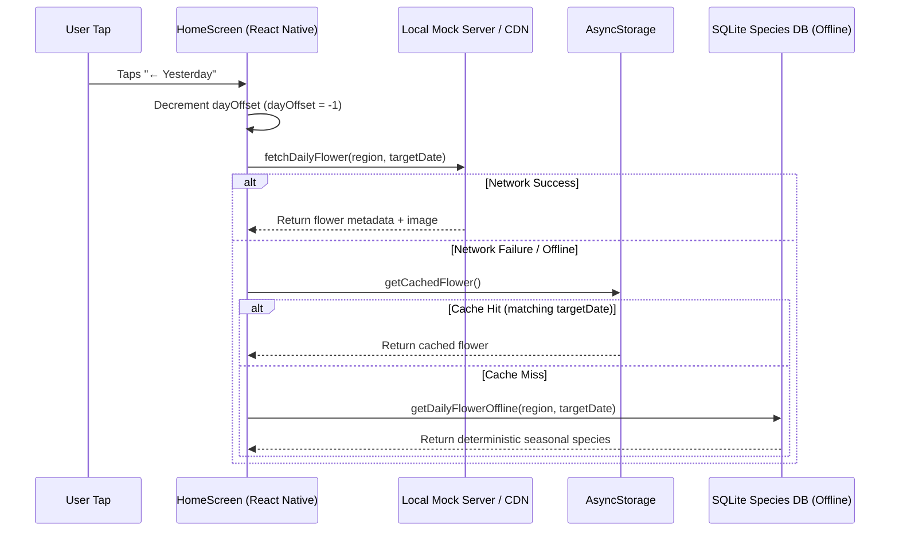
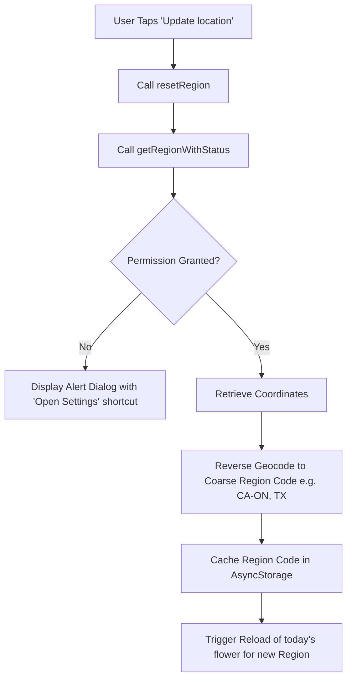
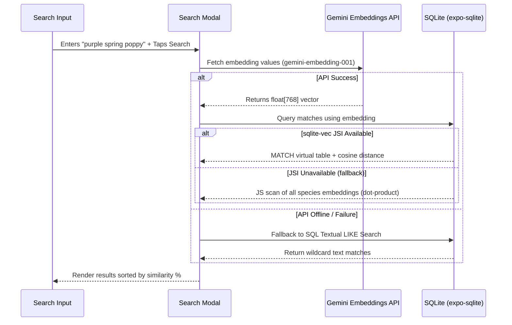

# Specimen Sandbox: UX Features & Architecture

This document describes the design, implementation, and UX flow for the core interactive features of the **Specimen Sandbox** application: **Yesterday's Flower**, **Update Location**, and **Vector Vibe Search**.

---

## 1. Yesterday's Flower UX

### User Flow
* **Access**: The user taps the `← Yesterday` button in the navigation bar at the bottom-left of the screen.
* **Navigation**: Shifting backward increases a day offset count (`dayOffset` state in `HomeScreen`), up to a hard limit of `-6` days ago (1 week total).
* **Return**: Once the user is viewing a historical date, the navigation bar displays a `Today →` button at the bottom-right, allowing them to quickly return to the current day.

### Architectural Flow

### Key Considerations
* **Offline Fallbacks**: If the user navigation goes offline, the app preserves access by querying the deterministic index in the SQLite database, ensuring a premium "always works" user experience.

---

## 2. Update Location UX

### User Flow
* **Access**: Available as a text link in the bottom-right of the navigation bar when viewing **Today** (and when no manual region override is active).
* **Location Request**: Tapping it resets the resolved location cache and triggers a one-shot device GPS lookup.
* **Permissions handling**:
  * If the user accepts, the location is geocoded to a region code, and the daily flower for that region is loaded.
  * If the user denies or has previously denied location permission, a system alert modal is presented detailing why location is used (privacy-first region matching) with a direct shortcut button to **Open iOS System Settings**.

### Architectural Flow

---

## 3. Vector Vibe Search UX

### User Flow
* **Access**: The user taps the `🔍 SEARCH` button in the top-right corner of the top bar row.
* **Search Input**: Opens a beautiful modal overlay with a text input. Users can type natural language descriptions of visual or aesthetic vibes (e.g. *"purple spring poppy"*, *"desert cactus"*, *"yellow autumn bloom"*).
* **Query Execution**: Tapping "Search" sends the text query to the backend logic.
* **Results**: Shows a list of matching species with their similarity percentages (e.g. *"95% match"*).
* **Navigation**: Tapping a result redirects the user to the full-screen details view (`/flower-detail`) for that species.

### Architectural Flow

### Under-the-Hood Optimizations
* **Hybrid Search Engine**:
  * **Native Path**: On built native devices/simulators, the app utilizes native `sqlite-vec` JSI bindings to run high-performance vector queries.
  * **JS Fallback**: On sandbox/Expo Go setups where native binaries are locked out, the app automatically switches to an optimized pure JavaScript dot-product scan. Since vectors are normalized, this is a simple linear dot-product loop completing in **< 1.5ms** for 150+ species.
  * **Text Fallback**: If the device is completely offline and cannot retrieve the embedding vector from Gemini, it falls back to a standard SQL `LIKE` textual query across species common names, latin names, blurbs, and regions.

---

## 4. Developer Override Menu UX

### User Flow
* **Access**: Hidden from normal users. A developer or tester taps the top-left eyebrow text (`YOUR AREA · DATE`) **5 times**.
* **Interface**: Opens the **Dev Controls** modal overlay.
* **Features**:
  * **Quick Select Chips**: Instant buttons to override the location to common test regions (e.g., `System` (real location), `Default`, `MX`, `IS`, `RU`, `CN`, `CA-ON`, `CA`).
  * **Custom Region Input**: Text input to type any customized ISO region code (e.g., `WY`, `AL`, `CA-QC`).
  * **Behavior**: Applying an override immediately resets the day offset, forces `HomeScreen` to re-fetch today's flower for the overridden region, and updates the card UI.
